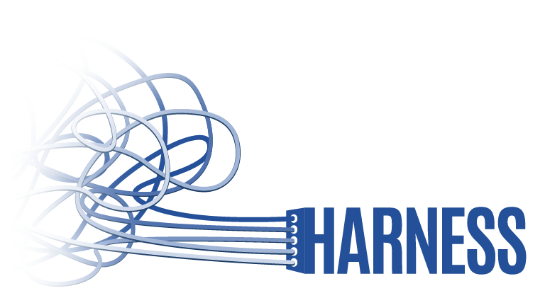

    

    
    

### Harness is a state management library for writing data-driven dashboards in Vue. 

When building dashboards for the web, good state management is hard. Writing getters, actions, mutations and state for every filter and every chart in a multi-page dashboard is a time-consuming process. Developers are often forced to weigh best practices against cost of labor, and incrementally build state and relationships between charts and filters over time - a process often responsible for technical debt. Harness aims to solve that problem by giving developers a method of defining each page in their application with syntax for defining charts and filters, then generates the following:
* A namespaced vuex module per page with:
    * State, mutations, actions and getters for all charts and filters
    * A unified interface for loading and processing data, combining multiple filters to create all charts
    * Common-use interactions for filters such as options, getters, setters and defaults
    * A robust data manipulation API for applying filters to and generating statistics from data arrays and objects

These features allow developers to rapidly prototype dashboard applications in Vue without having to cut corners for the sake of fast turnaround, and know that their products are ready for production right out of the gate with hardened, tested infrastructure.

Harness is often used in conjunction with [Harness-UI](https://ui.harnessjs.org), a component library that makes use of Harness API functions and Bootstrap CSS components to create grids, filters, charts and more.

For more information and full documentation, [visit our documentation website](https://harnessjs.org).

